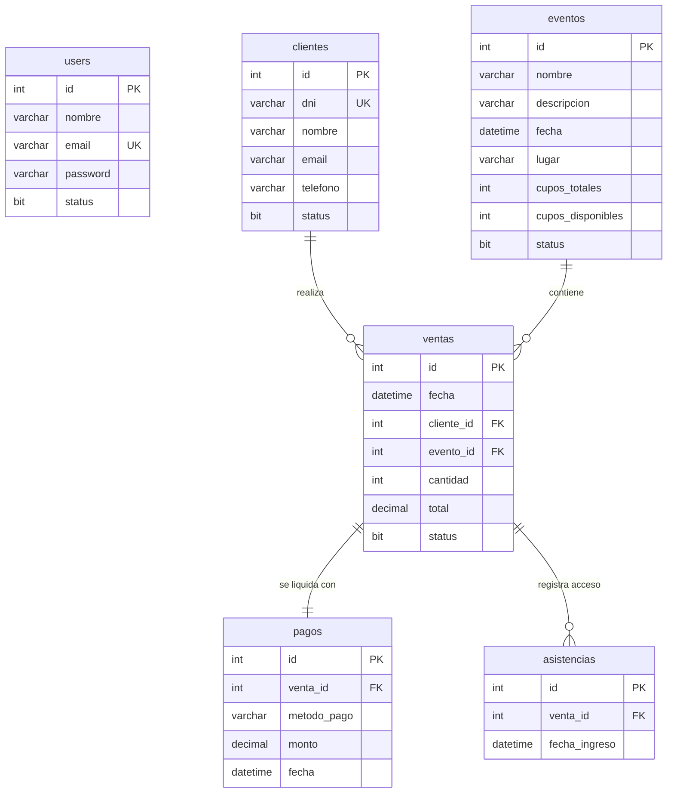

# Requerimientos del Sistema - EventSecurityApp

Este documento detalla los requerimientos funcionales, no funcionales y del modelo de datos para **EventSecurityApp**, una aplicación de escritorio premium en Java Swing para la gestión de ventas, pagos, control de acceso y seguridad en eventos.

---

## 1. Requerimientos Funcionales (RF)

### RF-01: Autenticación y Seguridad de Usuarios
* **RF-01.1: Inicio de Sesión**: Los usuarios deben poder autenticarse con su correo electrónico y contraseña.
* **RF-01.2: Encriptación de Contraseñas**: Las contraseñas se almacenan mediante hashing SHA-256.
* **RF-01.3: Cambio de Contraseña**: Permite a un usuario autenticado modificar su contraseña, verificando su contraseña anterior y requiriendo re-iniciar sesión por seguridad.
* **RF-01.4: Estado del Usuario**: Solo los usuarios con estado activo (`status = 1`) pueden ingresar al sistema.

### RF-02: Gestión de Eventos
* **RF-02.1: Registro de Eventos**: Crear nuevos eventos indicando nombre, descripción opcional, fecha y hora, lugar, y cupos totales.
* **RF-02.2: Edición de Eventos**: Modificar cualquier detalle de un evento existente.
* **RF-02.3: Consulta y Búsqueda**: Visualizar una lista de eventos y filtrarlos en tiempo real por nombre.
* **RF-02.4: Inactivación Lógica**: Dar de baja un evento de forma lógica (cambiando su `status` a 0) en lugar de eliminarlo físicamente.
* **RF-02.5: Gestión de Cupos**: Mantener un control del total de cupos y actualizar automáticamente los cupos disponibles al realizarse ventas.

### RF-03: Gestión de Clientes
* **RF-03.1: Registro de Clientes**: Registrar clientes indicando DNI único, nombre, correo electrónico y teléfono.
* **RF-03.2: Edición de Clientes**: Actualizar los datos de contacto y detalles del cliente.
* **RF-03.3: Consulta y Búsqueda**: Buscar clientes rápidamente por nombre mediante búsqueda interactiva.
* **RF-03.4: Inactivación Lógica**: Cambiar el estado de un cliente a inactivo en caso necesario.

### RF-04: Gestión de Ventas y Boletos (Pendiente de Implementar)
* **RF-04.1: Registro de Venta**: Crear una venta asociando un cliente y un evento específico, seleccionando la cantidad de boletos.
* **RF-04.2: Validación de Cupos**: No permitir la venta si la cantidad solicitada supera los cupos disponibles del evento.
* **RF-04.3: Cálculo de Totales**: Calcular automáticamente el costo total basado en la cantidad de boletos y actualizar el contador de cupos del evento en tiempo real en la base de datos de manera transaccional.

### RF-05: Gestión de Pagos (Pendiente de Implementar)
* **RF-05.1: Registro de Pago**: Registrar la transacción de pago de una venta, definiendo el método de pago (Efectivo, Tarjeta, Transferencia) y el monto pagado.

### RF-06: Control de Asistencias y Seguridad (Pendiente de Implementar)
* **RF-06.1: Registro de Ingreso**: Registrar la fecha y hora exacta de entrada de un boleto vendido (asociado a una venta).
* **RF-06.2: Prevención de Doble Ingreso**: Impedir el ingreso al evento si el boleto ya ha registrado una asistencia previa.
* **RF-06.3: Validación del Evento**: Validar que la asistencia corresponda al evento actual y que no esté inactivo.

---

## 2. Requerimientos No Funcionales (RNF)

* **RNF-01: Interfaz Premium (Estética y Usabilidad)**:
  * Diseño visual moderno utilizando temas armónicos (modo oscuro, contrastes visuales limpios, fuentes profesionales tipo Inter u Outfit).
  * Micro-animaciones en botones e interactivos para mejorar la respuesta al usuario.
  * Mensajes de confirmación (`JOptionPane`) claros y detallados ante cualquier operación crítica.
* **RNF-02: Rendimiento y Concurrencia**:
  * Manejo del hilo de despacho de eventos de Swing (`SwingUtilities.invokeLater`) para evitar bloqueos de la interfaz de usuario en consultas lentas.
  * Transacciones de base de datos robustas utilizando JDBC directo con rollback seguro ante fallos en la venta/pagos.
* **RNF-03: Arquitectura Limpia**:
  * Separación clara de responsabilidades siguiendo el patrón MVC (Model-View-Controller) y DAO (Data Access Object) para interactuar con la base de datos.
  * Singleton para la gestión de conexiones (`ConnectionManager`).
* **RNF-04: Portabilidad y Compatibilidad**:
  * Ejecución compatible con Java 21+ y gestor de dependencias Maven.
  * Conexión fluida con Microsoft SQL Server.

---

## 3. Modelo de Datos y Relaciones

El sistema se apoya en una base de datos relacional llamada `EventSecurityDB` con las siguientes entidades:

